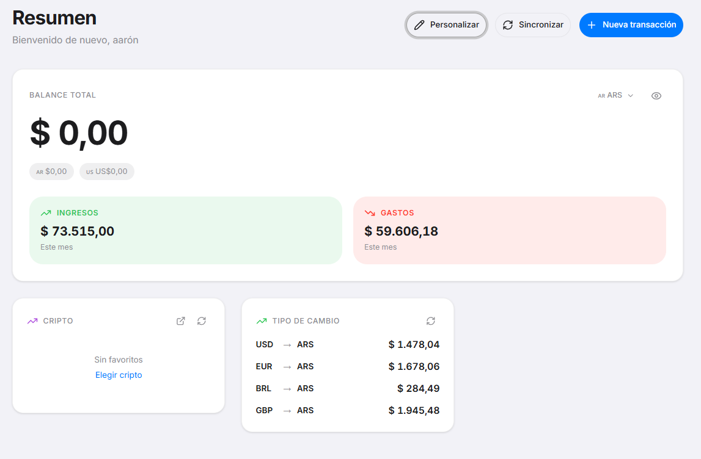
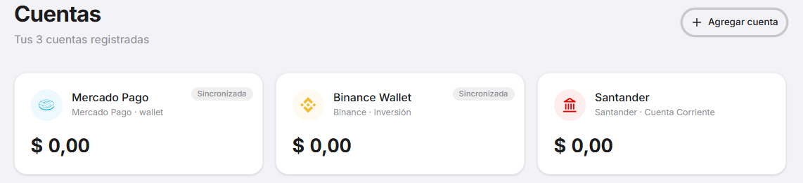
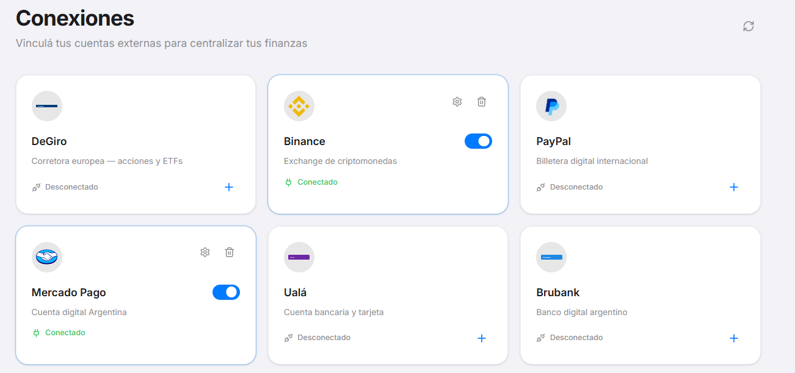

<div align="justify">
  
  
  
  
  
  <br />
  <h1>SyM Finance</h1>
  <p>Dashboard financiero personal con sincronización automática de cuentas, portfolio, suscripciones, cuotas, reservas y más.</p>
Fue mi primer proyecto que me tome enserio, la idea de unificar wallets en una sola app suena genial, pero en la practica me encontre com problemas, por ejemplo; la api de Mercado Pago no permite visualizar el balance de una forma sencilla, tampoco permite ver los ingresos de los fondos comunes. La verdad que me gusto mucho hacer el backend que es lo que me especializo, y el frontend se tipear pero no el design, por lo tanto acudi a la ia en ese caso.
</div>

<div align="center">
  
  
  
</div>

---

## Stack

| Capa       | Tecnología                                           |
|------------|------------------------------------------------------|
| Frontend   | Next.js 16 (App Router), React 19, Tailwind CSS 4, Framer Motion |
| Backend    | Express 5 (ESM), TypeScript                          |
| DB         | PostgreSQL + Prisma 7.8 (`@prisma/adapter-pg`)       |
| Auth       | JWT en cookies httpOnly, bcrypt                      |
| Encrypt    | AES-256-GCM para credenciales de APIs externas       |
| Monorepo   | npm workspaces + Turborepo 2                         |
| UI         | Radix UI, lucide-react, clsx + tailwind-merge, Recharts |

## Funcionalidades

### Core financiero
| Feature            | API | Frontend | Descripción |
|--------------------|-----|----------|-------------|
| **Cuentas**        | ✅  | ✅       | CRUD completo con balance, icono, color, tipo y moneda |
| **Movimientos**    | ✅  | ✅       | Ingresos/gastos por cuenta, con categorías y filtros |
| **Suscripciones**  | ✅  | ✅       | Gestión de suscripciones recurrentes (semanal, mensual, anual, etc.) |
| **Reservas**       | ✅  | ✅       | Metas de ahorro con progreso, categoría y fecha límite |
| **Cuotas**         | ✅  | ✅       | Planes de pago en cuotas con seguimiento de pagos y categorías |
| **Portfolio**      | ✅  | ✅       | Inversiones: acciones, bonos, letras, cripto (con precio actual) |

### Sincronización automática (auto-sync)
| Servicio                | API | Frontend |
|-------------------------|-----|----------|
| Binance                 | ✅  | ✅       |
| IOL (InvertirOnline)    | ✅  | ✅       |
| Mercado Pago            | ✅  | ✅       |
| PayPal                  | ✅  | ✅       |
| *Otros servicios*       | 🚧  | 🚧       | → 12 conexiones con logo y UI preparados (DeGiro, Ualá, Brubank, Lemon Cash, Belo, Fiwind, Cocos Capital, Bull Market, PPI)

### Extras
- **Dashboard personalizable** — Widgets reordenables (drag & drop) con balance, reservas, gastos del mes y movimientos recientes
- **Chat financiero** — Asistente conversacional con historial (API)
- **Panel de mercado** — Visualización de activos financieros
- **Cripto** — Seguimiento de tenencias cripto
- **Autenticación** — Registro, inicio de sesión, perfil con avatar
- **Preferencias** — Tema oscuro/claro
- **Multi-moneda** — USD, ARS, EUR, BRL, GBP, USDT (con conversión)

## Getting Started

### Prerrequisitos
- Node.js 20+
- PostgreSQL corriendo localmente

### 1. Clonar e instalar

```bash
git clone <repo-url>
cd sym-finance
npm install
```

### 2. Variables de entorno

Copiá `apps/api/.env.example` a `apps/api/.env` y completá los valores:

```bash
cp apps/api/.env.example apps/api/.env
```

| Variable         | Descripción                                     |
|------------------|-------------------------------------------------|
| `PORT`           | Puerto del servidor Express (default: 5000)      |
| `DATABASE_URL`   | Connection string de PostgreSQL                  |
| `JWT_TOKEN`      | Secreto para firmar JWT (64 bytes hex)           |
| `ENCRYPTION_KEY` | Clave AES-256-GCM (32 bytes hex)                |

### 3. Base de datos

```bash
cd apps/api
npx prisma migrate dev --name init
```

### 4. Desarrollo

```bash
# Desde la raíz — levanta API (:5000) + Client (:3000)
npm run dev

# O individualmente
turbo dev --filter=@sym-finance/api
turbo dev --filter=@sym-finance/client
```

### 5. Build

```bash
npm run build
```

### Otros comandos

```bash
npm run typecheck     # tsc --noEmit en todos los paquetes
npm run lint          # ESLint
turbo build --filter=@sym-finance/api   # build solo API
turbo dev --filter=@sym-finance/client  # dev solo client
```

## Estructura del proyecto

```
sym-finance/
├── apps/
│   ├── api/                  # Express 5 (ESM)
│   │   ├── prisma/
│   │   │   ├── schema.prisma # Modelo de datos
│   │   │   └── migrations/   # Migraciones Prisma
│   │   └── src/
│   │       ├── app.ts        # Entrypoint, registro de rutas
│   │       ├── routes/       # 11 routers
│   │       ├── services/     # Lógica de negocio + sync handlers
│   │       ├── middleware/    # Auth middleware (JWT)
│   │       ├── types/        # Interfaces compartidas
│   │       └── utils/        # db, jwt, encryption
│   │
│   └── client/               # Next.js 16 App Router
│       ├── app/
│       │   ├── auth/         # Login / Register
│       │   ├── dashboard/    # 11 páginas del dashboard
│       │   ├── components/   # UI components compartidos
│       │   └── libs/         # Axios instance, helpers
│       ├── public/logos/     # 12 SVG logos de servicios
│       └── middleware.ts     # Protección de rutas
│
├── packages/
│   ├── eslint-config/        # ESLint config compartida
│   └── typescript-config/    # TSConfig base
│
├── turbo.json
└── package.json
```

## Modelo de datos (Prisma)

- **User** — Usuarios con auth, avatar y preferencias
- **Account** — Cuentas bancarias/billeteras con balance y moneda
- **Operation** — Transacciones (ingreso/gasto) vinculadas a cuentas
- **Reserve** — Metas de ahorro con progreso
- **PortfolioItem** — Tenencias de activos (acciones, bonos, letras, cripto)
- **Subscription** — Suscripciones recurrentes con frecuencia
- **Installment** — Planes de pago en cuotas
- **Connection** — Conexiones a servicios externos (credenciales encriptadas)
- **ChatMessage** — Historial del chat asistente

## API Endpoints

| Ruta                  | Métodos         | Descripción                |
|-----------------------|-----------------|----------------------------|
| `/api/auth`           | POST, GET, PUT  | Registro, login, perfil    |
| `/api/accounts`       | CRUD            | Cuentas                    |
| `/api/transactions`   | CRUD            | Movimientos                |
| `/api/subscriptions`  | CRUD            | Suscripciones              |
| `/api/reserves`       | CRUD            | Reservas/metas             |
| `/api/installments`   | CRUD            | Cuotas                     |
| `/api/connections`    | CRUD + sync     | Conexiones externas        |
| `/api/market`         | GET             | Datos de mercado           |
| `/api/preferences`    | GET, PUT        | Preferencias de usuario    |
| `/api/profile`        | GET, PUT        | Perfil + avatar            |
| `/api/iol`            | GET             | Datos IOL                  |

Todas las rutas (excepto auth) usan `middleware.processToken` para autenticación vía JWT en cookie.

## Aclaración sobre el frontend

**El frontend de este proyecto fue generado mayoritariamente con asistencia de IA.** Mi fuerte no es el diseño UI/UX, por lo que es probable que encuentres estilos inconsistentes, falta de estados de carga/error, o componentes que no siguen las mejores prácticas de accesibilidad. Si bien es funcional, el foco principal del proyecto está en el backend, la arquitectura de datos y la lógica de sincronización financiera. Pull requests que mejoren la interfaz son bienvenidos.

---

## Licencia

ISC — [Aaron](https://github.com/anomalyco)
